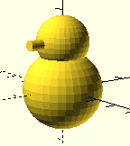

PSML - Python Solid Modeling Library

PSML is a Python library (Python 3 required) for writing
3D models that can be rendered and processed by OpenSCAD.

OpenSCAD is a great tool for rendering a 3D model and generating
an stl file from it for 3D printing.
The OpenSCAD built-in language is effective for simple projects,
but I missed the general-purpose features of a true programming language,
so why not use Python to create OpenSCAD files?
Apparently I was not the first with this idea, but I found the
existing libraries unsatisfactory, at least to me.

Simple example:

~~~Python
from psml import *
( sphere( 15 ) + 
  shift( 0, 0, 18 ) ** (
      sphere( 10 ) +
      rotate( 90, 0, 0 ) ** cylinder( 2, 15 ))).write( "example" )
~~~

Sphere and cylinder are 3D solids. 
Shift is a 3D operator that shifts its subject in the specified
z, y and z direction. 
Rotate rotates its subject by the around the specified angles
(in degrees) around the x, y and z axises.
The + operator combines solids.
Finally the write method writes the corresponding OpenSCAD code
to the example.stl file.
When this file is opened in OpenSCAD it renders a primitive snowman.

Another example:
   
~~~Python
from psml import *
from functools import reduce
m = reduce( 
   lambda a, b: a + b, (
      ( 25 * shift( x, y )) ** (
         sphere( 15 ) + 
         shift( 0, 0, 30 ) ** sphere( 10 ) + 
         cylinder( 3, 30 )
      ) for x in range( 0, 10 ) for y in range( 0, 10 )))
w.write( "example" )
~~~

   

Similar libraries:
   - [SolidPython](https://github.com/SolidCode/SolidPython)
   - [OpenPySCAD](https://pypi.org/project/OpenPySCAD)

-----------------------------------------------------------------------------      
      
(c) Wouter van Ooijen (wouter@voti.nl) 2020

Distributed under the Boost Software License, Version 1.0.
(See accompanying file LICENSE_1_0.txt or copy at 
http://www.boost.org/LICENSE_1_0.txt) 